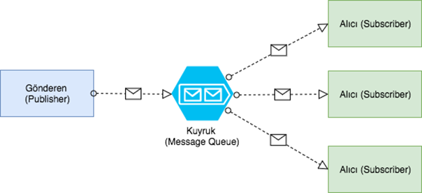

# APACHE KAFKA NEDİR?

* Bir **message broker** sistemidir. Mesaj alınır bir alanda depolanır ve mesaj buradan okunup ilgili alanlara dağıtılır. Kuyruk (Queue) sistemi ve daha fazlasıdır.
* Scala ve Java ile yazılmıştır.
* Mesajlar index yapısına göre yazılır ve okunur. 
* Index yapısından dolayı oldukça hızlı bir sistemdir.

## Nerelerde Kullanılır? 
* Web sayfası etkinlik izlemelerinde
* İzleme sistemlerinde ki metriklerde (CPU, Disk Takibi vb.)
* Log toplama sistemlerinde
* Stream Processing işlemlerde (Dağıtma gereken sistemlerinde örneğin: Youtube vb.)

## Avantajları
* Yüksek trafikte düşük gecikme sağlar.
    * High throughtput and low latency
* Ölçeklenebilir (Scalable)
    * Node ve Partition ile yatak ölçeklendirme yapılır.
* Güvenilir (Reliable)
    * Ölçeklendirilmiş ve hata tolere edilebilir.
* Sağlam (Durable)
    * Veri kaybı yok, mesajlar disk üzerine immutable log ile yazılır.
* Apache Projeleri açık kaynaktır.

## Kullanan Şirketler 
* Uber, Netflix, Activision, Spotify, Slack, Pinterenst, Linkedin

## Kafka'nın Bileşenleri

* **Producer**: Kafka'nın toplayacağı dataları Topic’lere gönderen kısımdır.
* **Partiton**: Topic’ler partition’lara ayrılırlar. Partition’lar 0’dan başlayarak artan sayıda devam eder. Topic yaratırken verilen partition sayısı sonradan değiştirilebilir.
* **Topic**: Producer'dan gönderilen dataları depolayan birimlerdir. İstenildiği kadar topic oluşturulabilir.
* **Kafka Broker**: partitionlar bir araya gelerek Broker’i oluşturur. Broker’lar bir araya gelince Kafka Cluster’i oluştururlar.
* **Consumer**: Topiclere bağlanan ve topicleri tamamen tüketene kadar okuyan birimdir. Birçok consumer bir araya gelerek belirli bir düzen içinde okuma yapınca bu duruma **Consumer Group** denir.

## Kafka Nasıl Çalışır?

1) Kafka Cluster'ı kurarken ilk başta Topic üretilir.
2) Producer, okunan dataları Topic'e push eder.
3) Consumer, Topic'i Queue(kuyruk) yapısına göre Topic'te data kalmayacak şekilde okur.

> Kafka, içerisinde Message Queue ve Publish-Subscribe olmak üzere iki model barındırır.

**Oueue:** Mesaj bir kere publish edilir ve bir kere consumer tarafından consume edilir. Sonra Queue üzerinde mesaj silinir.

**Pub/Sub(Publisher-Subscriber):** Mesaj publish edildiğinde birden fazla kez consume edilir.

## Consumer Group 

* Partition'ların paralel olarak işlenmesi için kullanılır.
* Bir consumer bir partition okumaktan sorumludur ve olması gereken böyledir. Böyle uygulanması performans açısından da daha uygundur.
* Fakat bu durum **Consumer Group** ile değiştirilebilir.
* Consumer Group ile Queue ve Pub/Sub metodlarını aynı anda kullanımına imkan sağlar.
* Birden fazla consumer olduğunda consumer'lar arası balancing işlemini Consumer Group sağlar.

> Customer Group Queue gibi davranması isteniyorsa;
* Tüm Consumer'ları bir grup içerisinde tutmalıdır. (Aşağıdaki örnekte olduğu gibi) 

> Customer Group Pub/Sub gibi davranması isteniyorsa;
* Her bir Consumer'ı kendine ait başka bir Consumer Group içine aktarılmalıdır. (Aşağıdaki örnekte olduğu gibi) 

## Apache Zookeeper
Kafka'ya bağlanıp Kafka ile beraber bilgilerin stabil bir şekilde tutulmasını sağlar.

Sürekli Kafka Broker'a bağlı çalışan bir model olarak düşünülebilir.

### Kaynaklar
* [Kablosuz Kedi Apache Kafka Videosu](https://www.youtube.com/watch?v=ZphPT3r6fnU&t=1060s&ab_channel=kablosuzkedi)
