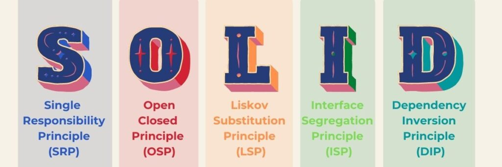

# SOLID PRINCIPLES

Yazılımda SOLID uygulandığı taktirde bakımı ve geliştirilmesi kolay yazılım sistemleri oluşturmak mümkündür. Robert C. Martin tarafından ileri sürülen ve kısaltması Michael Feathers tarafından düşünülen bu prensiplerin amacı; kod tekrarına düşmeyerek, sürdürülebilir, anlaşılabilir, esnek ve yeniden kullanılabilir yazılımlar geliştirmektir.

SOLID prensipleri, bir yazılım geliştiricinin Nesne Yönelimli Programlama (OOP) ile yazılım geliştirirken, geliştirdiği yazılımın esnek ve geliştirilmeye uygun olması için uyması gereken kurallar bütünüdür. “Spaghetti Code” kodlar yerine, “Clean Code” yazmayı bu prensipler sağlamaktadır.

Dünya standartlarında yazılım geliştirmemize olanak sağlayan bu prensipleri 5 ana başlıkta ele alabiliriz.
**S**-Single Responsibility Principle
**O**-Open/Closed Principle
**L**-Liskov Substitution Principle
**I**-Interface Segregation Principle
**D**-Dependency Inversion Principle

- **Single Responsibility Principle**
Her yazılım biriminin (sınıf, nesne, metot) tek bir sorumluluğu olmalıdır.

- **Open/Closed Principle**
Yazılım birimleri geliştirilmeye açık, değişikliğe kapalı olmalıdır.

- **Liskov’s Substitution Principle** 
Alt sınıflardan oluşturulan nesneler üst sınıfların nesneleriyle yer değiştirdiklerinde aynı davranışı göstermek zorundadırlar.

- **Interface Segregation Principle**
Herşeyi ihtiva eden interface sınıflar yerine belli bir işlemi yapan interface sınıflar oluşturulmalıdır.

- **Dependency Inversion Principle**
Bağımlılıklar soyut sınıflara doğru olmalıdır.